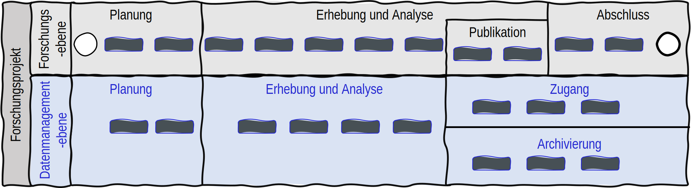

Reifegradmodelle für das Forschungsdatenmanagement in Forschungsprojekten
==================================================

Auf dieser Website finden Sie Informationen über Reifegradmodelle für das Forschungsdatenmanagement (**FDM**) und ihre Anwendung in Forschungsprojekten.
Für definierte Prozessbereiche, die einzelnen Phasen des FDM, finden Sie eine individuelle Seite mit allgemeinen Informationen und einem entsprechenden Reifegradmodell zu 
dieser Phase. Die Reifegradmodelle besitzen für die Reifegradbestimmung eine Auflistung von Zielen und Praktiken einer entsprechenden Reifestufe.

Qualitätsbewertung für das Forschungsdatenmanagement in Forschungsprojekten
--------
Für die forschungsnahe Umsetzung des Forschungsdatenmanagements werden, um Forschenden eine möglichst prozessnahe Umsetzung des Forschungsdatenmanagements nahezulegen, datenmanagementbezogene Aktivitäten (*Datenmangementebene*) in den Forschungsprozess (*Forschungsebene*) implementiert. Dabei werden die Aktivitäten für das Forschungsdatenmanagement auf Basis ihres Auftretens im Forschungsprozess in definierten Prozessbereichen zusammengefasst. Für diese Prozessbereiche werden einzelne Reifegradmodelle entwickelt, welche den Forschenden eine qualitative Bewertung ihres Forschungsdatenmanagements in Abhängigkeit des Forschungsprozesses ermöglichen. Die Reifegradmodelle folgen dabei einer `allgemeinen Reifegradcharakteristik <https://maturitymodel-rtd-tutorial.readthedocs.io/en/latest/reifegradmodell.html#allgemeine-reifegradcharakteristik>`_, welche eine  Bewertung auf verschiedenen Reifestufen, von einem Ausgangszustand bis zu einem optimierenden Endzustand, ermöglicht.

\

*Interaktives Prozessmodell zur integration des Forschungsdatenmanagements in den Forschungsprozess* 
--------
.. raw:: html
    :file: BPMN.html

An wen richten sich die Modelle?
--------
Da für die Umsetzung des Forschungsdatenmanagements in erster Linie die Forschenden verantwortlich sind, richten sich die Reifegradmodelle direkt an Forschende im Forschungsprojekt. 
Die Reifegradmodelle dienen dazu, den Forschenden im Forschungsprojekt eine Möglichkeit zur Selbstbeurteilung ihres Forschungsdatenmanagements zu bieten.
Die Reifegradmodelle sollen den Forschenden helfen, ihre Forschungsdatenmanagementpraktiken zu verbessern und den Anforderungen für ein vollumfängliches Forschungsdatenmanagement gerecht zu werden. Dafür wird jeder Prozessbereich auf einer eigenen Seite dargestellt, auf der neben dem entsprechenden Reifegradmodell mit den Zielen und Praktiken auch weitere Inhalte präsentiert werden. 
Durch die Integration dieser Modelle in den Forschungsprozess wird eine möglichst prozessnahe Umsetzung des Forschungsdatenmanagements angestrebt. Dies unterstützt die Forschenden dabei, ihre Forschungsdaten effektiv zu planen, zu erheben, zu analysieren, zu archivieren und den Zugang zu ermöglichen.

Prozessbereiche des Forschungsdatenmanagements im Forschungsprozess
--------
* :ref:`Planung` 
* :ref:`Erhebung` 
* :ref:`Analyse` 
* :ref:`Archivierung` 
* :ref:`Zugang` 

*Interaktive Übersicht der Reifegradmodelle*
--------

.. raw:: html
    :file: RGM_Gesamt.html

 
\
.. toctree::
   :caption: Reifegradmodell
   :hidden:

   reifegradmodell

.. toctree::
   :caption: FDM Phasen
   :hidden:
   
   Planung 
   Erhebung
   Analyse
   Archivierung
   Zugang
   
.. note::

   This project is under active development.

.. note::

   Max Leo Wawer möchte sich bei Bund, Ländern und bei der Gemeinsamen Wissenschaftskonferenz (GWK) für die Förderung und Unterstützung im Rahmen des Konsortiums NFDI4Ing bedanken.
   Gefördert durch die Deutsche Forschungsgemeinschaft (DFG) - Projektnummer 442146713. 
   
   Max Leo Wawer would like to thank the Federal Government and the Heads of Government of the Länder, as well as the Joint Science Conference (GWK), for their funding and support
   within the framework of the NFDI4Ing consortium. Funded by the German Research Foundation (DFG) - project number 442146713.

