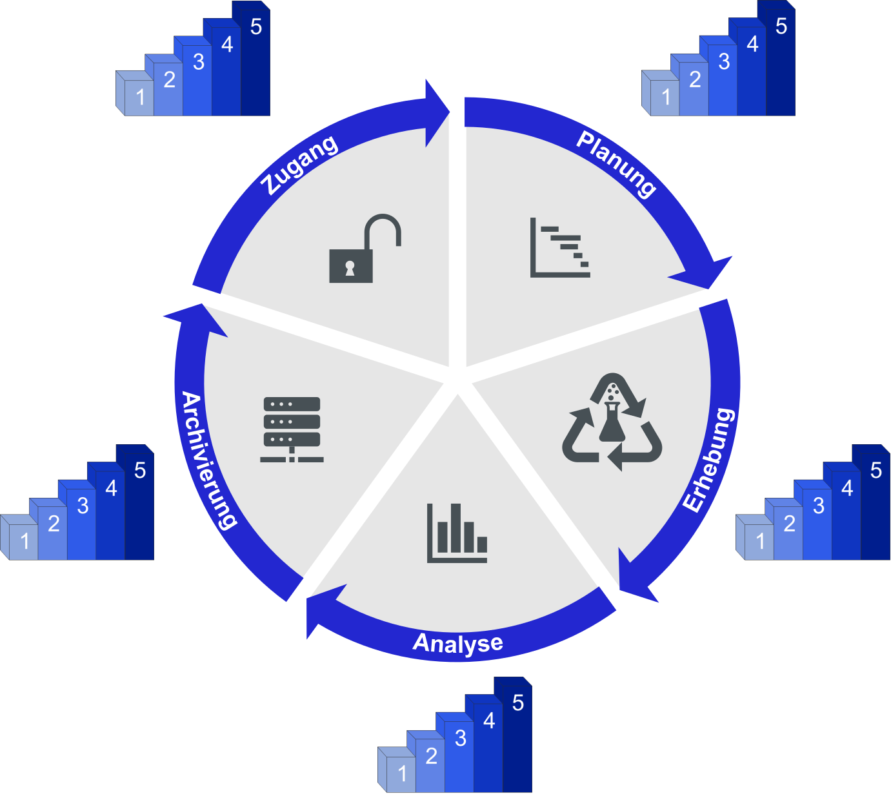
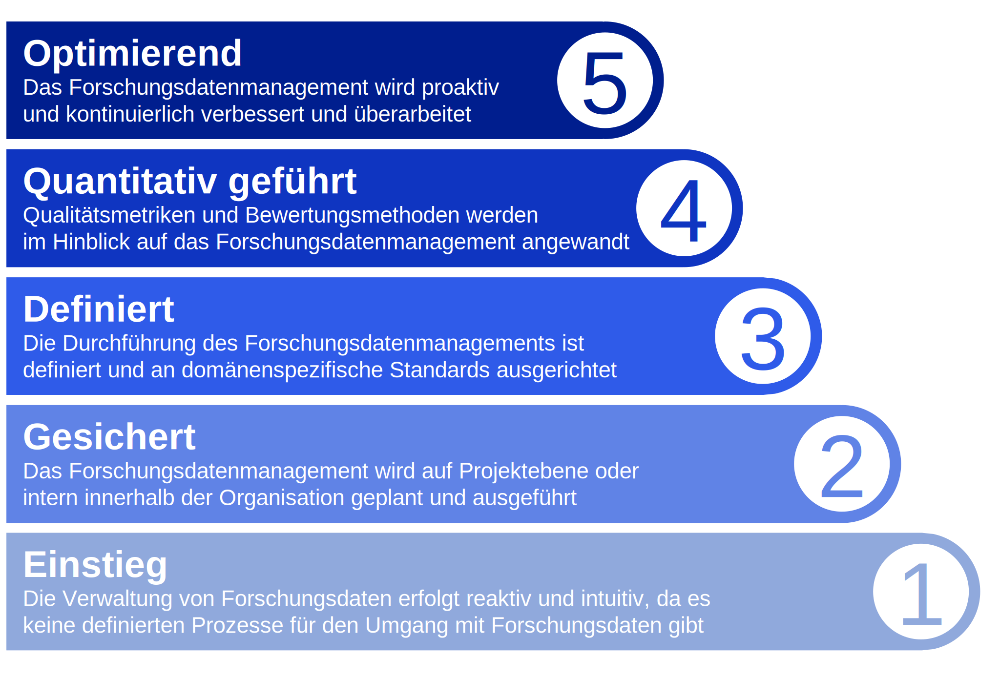

Reifegradmodell
##################

Definierte Prozessbereiche
--------------
Durch die Integration der Forschungsdatenmanagement-Aufgaben in den ingenieurwissenschaftlichen Forschungsprozess haben sich folgende Prozessbereiche für das Forschungsdatenmanagement ergeben, für welche einzelne Reifegradmodelle entwickelt werden. Es werden die grundlegenden Aufgaben für ein vollumfängliches FDM des jeweiligen Prozessbereichs aufgezeigt, wodurch den Forschenden eine forschungsprozessorientierte Identifizierung ihrer Qualität in der Umsetzung des Forschungsdatenmanagements ermöglicht wird. 

Eine schematische Darstellung ist in einem adaptierten Datenlebenszyklus dargestellt. Die Phase der Nachnutzung ist in die Phase der Datenerhebung integriert, da diese Phase die Erhebung neuer Daten, oder die Sammlung bestehender Daten zur Nachnutzung vorsieht.

Allgemeine Reifegradcharakteristik
----------------
Die einzelnen Reifegradmodelle folgen einer definierten einheitlichen Reifegradcharakteristik, welche sich an den Zielen des Forschungsdatenmanagement und bestehender Reifegradmodelle orientiert. Grundlegend wurde dafür die Grundstruktur des CMMI [1] adaptiert. 

=========
Merkmalsauflistung
=========

.. footer:: Referenzen

.. footer:: [1] CMMI Product Team: CMMI for Development, Version 1.3., Technical Report, 2010, `Link <https://insights.sei.cmu.edu/documents/853/2010_005_001_15287.pdf>`_.
