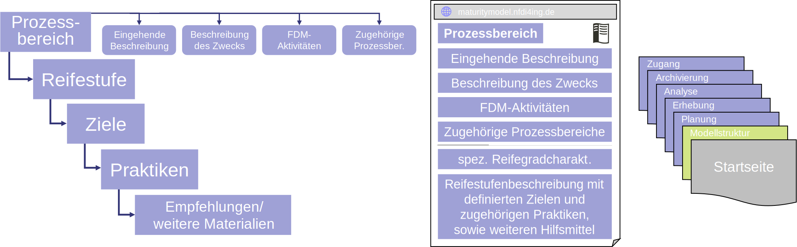

Modellstruktur
##################

Definierte Prozessbereiche
--------------
Durch die Integration der Forschungsdatenmanagement-Aufgaben in den ingenieurwissenschaftlichen Forschungsprozess haben sich folgende Prozessbereiche für das Forschungsdatenmanagement ergeben, für welche einzelne Reifegradmodelle entwickelt werden. Es werden die grundlegenden Aufgaben für ein vollumfängliches FDM des jeweiligen Prozessbereichs aufgezeigt, wodurch den Forschenden eine forschungsprozessorientierte Identifizierung ihrer Qualität in der Umsetzung des Forschungsdatenmanagements ermöglicht wird. 

Eine schematische Darstellung ist in einem adaptierten Datenlebenszyklus dargestellt. Die Phase der Nachnutzung ist in die Phase der Datenerhebung integriert, da diese Phase die Erhebung neuer Daten, oder die Sammlung bestehender Daten zur Nachnutzung vorsieht.

Allgemeine Reifegradcharakteristik
----------------
Die einzelnen Reifegradmodelle folgen einer definierten einheitlichen Reifegradcharakteristik, welche sich an den Zielen des Forschungsdatenmanagement und bestehender Reifegradmodelle orientiert. Grundlegend wurde dafür die Grundstruktur des CMMI [1] adaptiert. 

Modellaufbau
----------------
Zu jedem Prozessbereich gibt es ein individuelles Reifegradmodell, welches sich an den FDM-Aufgaben dieser Phase orientiert. Neben einer Kurzbeschreibung der einzelnen Reifestufen, werden auf den einzelnen Reifestufen *Ziele* definiert, welche zum Erreichen der jeweiligen *Reifestufe* erfüllt werden müssen. Den einzelnen *Zielen* sind weitere *Praktiken* zur Erreichung dieser Ziele zugeordnet. Zudem sind den einzelnen Zielen noch *Empfehlungen/weitere Materialien*  in Form von Best Practices, weiterführenden Informationen und nutzbaren Tools und Services zugeordnet, welche sich allgemein auf die zugehörigen Ziele beziehen. Hierbei werden allgemeine und ingenieurspezifische Materialien beigefügt, welche nicht nur, aber vornehmend innerhalb der NFDI4Ing, mit ihrem Anspruch, die nationale Forschungsdateninfrastruktur der ingenieurwissenschaftlichen Forschung zu verbessern, entwickelt wurden.

**********
Reifestufe *X*
**********

+-------------------------------------------------------+----------------------------------------------------------+-------------------------------------------------------------------------------------------------------------------------------------------------------------------------------+
| Ziele                                                 | Praktiken                                                |  Empfehlungen/weitere Materialien                                                                                                                                             |
+=======================================================+==========================================================+===============================================================================================================================================================================+
| *Phase.Reifestufe.Zielnr.*:                           |  *zugehörige Praktik*                                    | *zugehörige Hilfsmittel, Best Practices, o.Ä.*                                                                                                                                |
|                                                       |                                                          |                                                                                                                                                                               |
|                                                       |                                                          |                                                                                                                                                                               |
|                                                       +----------------------------------------------------------+-------------------------------------------------------------------------------------------------------------------------------------------------------------------------------+
|                                                       |  *zugehörige Praktik*                                    | *zugehörige Hilfsmittel, Best Practices, o.Ä.*                                                                                                                                |
|                                                       |                                                          |                                                                                                                                                                               |
|                                                       |                                                          |                                                                                                                                                                               |
|                                                       +----------------------------------------------------------+-------------------------------------------------------------------------------------------------------------------------------------------------------------------------------+
|                                                       |  *zugehörige Praktik*                                    | *zugehörige Hilfsmittel, Best Practices, o.Ä.*                                                                                                                                |
|                                                       |                                                          |                                                                                                                                                                               |
|                                                       |                                                          |                                                                                                                                                                               |     
+-------------------------------------------------------+----------------------------------------------------------+-------------------------------------------------------------------------------------------------------------------------------------------------------------------------------+

.. footer:: Referenzen

.. footer:: [1] CMMI Product Team: CMMI for Development, Version 1.3., Technical Report, 2010, `Link <https://insights.sei.cmu.edu/documents/853/2010_005_001_15287.pdf>`_.
